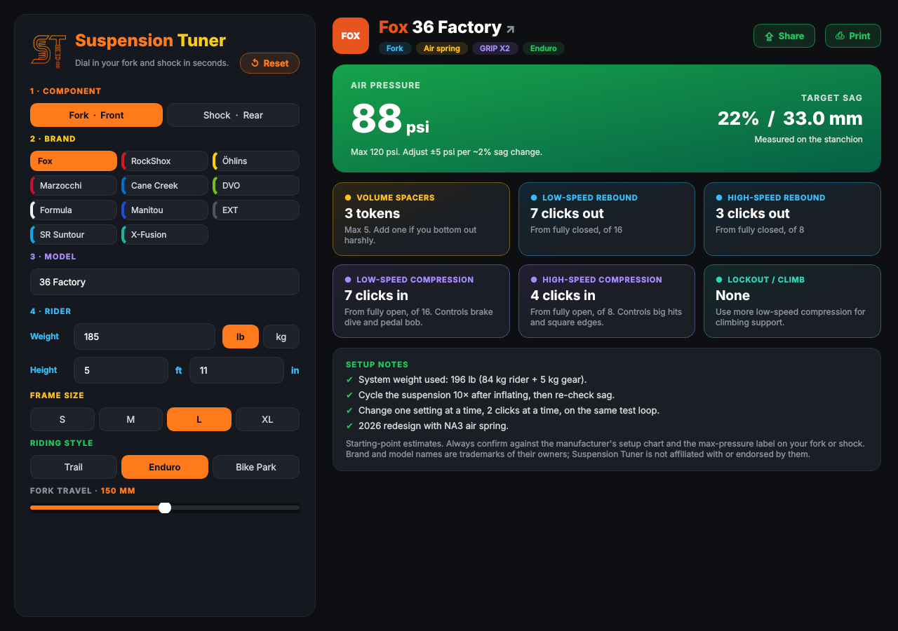
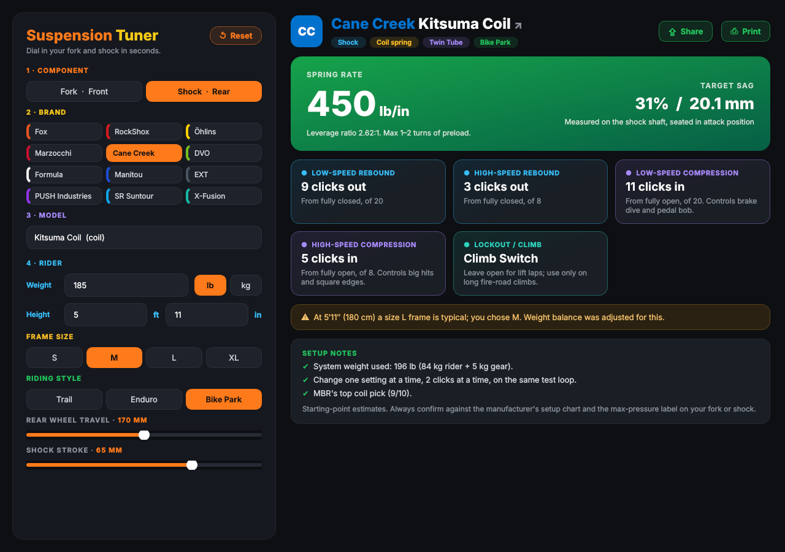

# Suspension Tuner

Pick a fork or rear shock, choose the brand and model, then enter your weight, height, frame size and riding style. The app returns a starting setup: air pressure or coil spring rate, sag, volume spacers, rebound, low- and high-speed compression and rebound, lockout use, fit warnings and setup notes.




## Features
- Fork or shock → brand → model, then weight (lb/kg), height (ft + in), frame size and riding style
- **Reset** button (⌘R / Ctrl+R) clears everything
- Results card in green with colour-coded settings (rebound = blue, compression = purple, tokens = amber, lockout = teal)
- Brand badge next to the model name. To use real logos in the SwiftUI app, add images named
  `logo-<brand>` to the app's Assets catalog (`logo-fox`, `logo-rockshox`, `logo-ohlins`, `logo-cane-creek`, …).
  They replace the coloured monogram automatically.
- Click the brand badge or model name in the results header to open that model's spec page on the
  manufacturer's website (`url` in catalog.json; models without a verified page fall back to a search of the brand's site)
- **Share** (image or text on macOS/iOS; copy text / PNG / PDF in the Python app) and **Print** (⌘P / Ctrl+P)

## Layout

| Path | What |
|---|---|
| `apple/Sources/SuspensionKit/Resources/catalog.json` | **Single source of truth**: 65 forks and shocks from 13 brands (both apps read it) |
| `apple/Sources/SuspensionKit/` | Swift catalog and calculation engine |
| `apple/Sources/SuspensionTunerApp/` | SwiftUI app (macOS + iOS, adaptive layout) |
| `apple/AppResources/Assets.xcassets` | App icon (iOS + macOS) and the place to drop `logo-<brand>` images |
| `apple/project.yml` | XcodeGen spec for the iOS/macOS Xcode project |
| `python/suspension_engine.py` | Python port of the engine (kept 1:1 with `Engine.swift`) |
| `python/app.py` | PySide6 desktop GUI (runs on macOS, Windows, Linux) |

## Run

**Install on your Mac (Applications + Dock)**
```sh
cd apple
./build-mac.sh        # builds, copies "Suspension Tuner.app" to /Applications and opens it
```
Then right-click the Dock icon → Options → Keep in Dock. Re-run the script after pulling updates.

**macOS / iOS (Xcode)**
```sh
cd apple
brew install xcodegen && xcodegen generate
open SuspensionTuner.xcodeproj      # pick an iPhone simulator or "My Mac" and hit Run
```
Quick Mac-only run without Xcode project: `cd apple && swift run SuspensionTunerApp`

**Python desktop**
```sh
cd python
pip install -r requirements.txt
python3 app.py
```

## Tests
Both engines are pinned to the same golden values:
```sh
cd apple && swift test
cd python && python3 -m unittest test_engine.py
```

## How the numbers are calculated
- **System weight** = rider + 5 kg of gear. Front/rear weight split starts at 40/60 and shifts forward for larger frames, or when the rider is big for the chosen frame. The recommended frame size comes from height.
- **Sag target** by style. Fork: trail 20%, enduro 22%, bike park 23%. Shock: 28, 30 and 31%. XC products run 2–3% less.
- **Air pressure** = model pressure ratio × system weight × weight-split factor × sag factor (× leverage ratio for shocks). Capped at the model's maximum psi, with a warning.
- **Coil rate** = rear load × leverage ratio ÷ (sag × stroke), rounded to 25 lb/in.
- **Damping**: rebound slows as weight goes up. Low- and high-speed compression firm up from trail to enduro to bike park and with weight. Every value is given in clicks for that model's adjuster range.

These are starting points. Per-model ratios and click counts are approximations, so always check the manufacturer's setup chart and the max-pressure label on the product.
